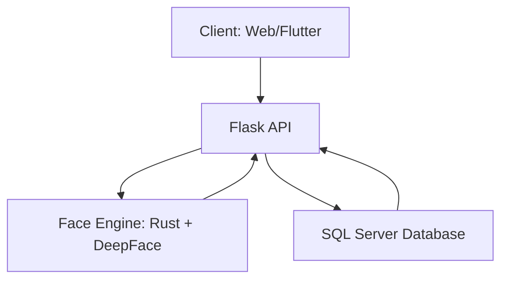
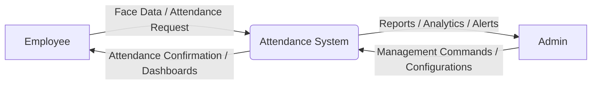
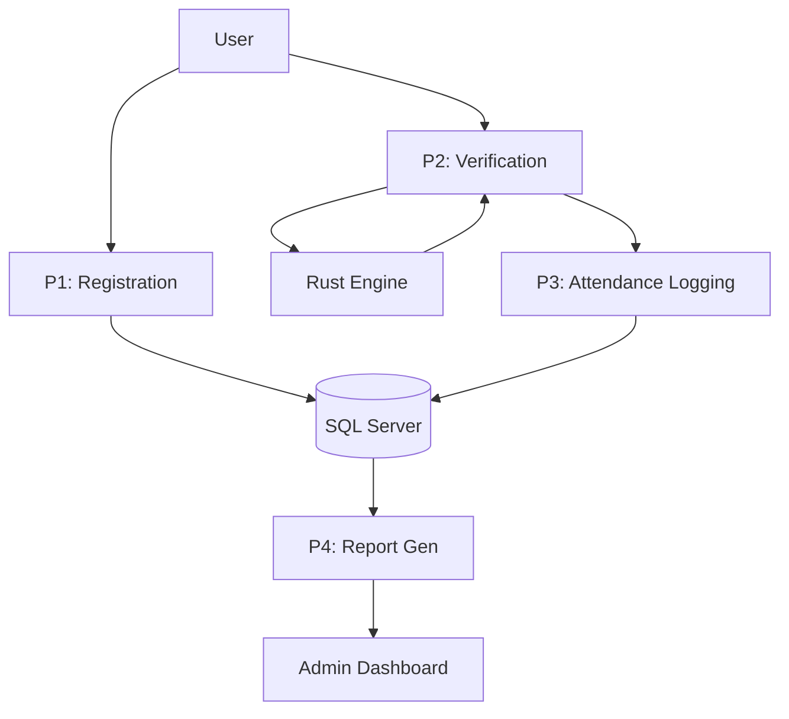

# PROJECT REPORT: FACE RECOGNITION ATTENDANCE SYSTEM

## CHAPTER 1: INTRODUCTION

### 1.1 Project Overview
The **Face Recognition Attendance System** is a state-of-the-art solution designed to automate the process of recording and managing employee attendance. In modern corporate environments, traditional methods of attendance tracking—such as manual registers, ID cards, or fingerprint scanners—often face challenges related to efficiency, security, and hygiene. This project leverages advanced Artificial Intelligence (AI) and Machine Learning (ML) techniques to provide a contactless, secure, and highly accurate attendance management experience.

The system utilizes a hybrid face recognition engine, combining the speed of **Rust** for face detection and the robustness of **DeepFace (ArcFace)** for identity verification. All data, including user profiles, attendance logs, and meeting schedules, are persisted in **Microsoft SQL Server (SSMS)**, ensuring enterprise-grade reliability and scalability.

### 1.2 Problem Statement
Traditional attendance systems suffer from several key issues:
- **Proxy Attendance**: Manual or card-based systems can be easily bypassed by employees "clocking in" for their colleagues.
- **Biometric Limitations**: Fingerprint scanners can fail due to dirty, dry, or injured fingers, and they raise hygiene concerns, especially in post-pandemic settings.
- **Administrative Overhead**: Manually consolidating logs into reports is time-consuming and prone to human error.
- **Lack of Real-time Insights**: Supervisors often lack immediate visibility into who is present, late, or on leave at any given moment.

### 1.3 Objectives
The primary objectives of this project are:
1.  **Automation**: Eliminate manual intervention in attendance recording.
2.  **Security**: Ensure that only authorized personnel can mark attendance through facial verification.
3.  **Real-time Monitoring**: Provide a live dashboard for administrators to monitor attendance, late arrivals, and leave status.
4.  **Comprehensive Reporting**: Generate automated reports for payroll and performance evaluation.
5.  **Multi-Platform Access**: Offer a responsive web dashboard for administrators and a mobile-friendly interface for employees.

### 1.4 Scope
The system is divided into three core modules:
- **Admin Module**: Employee management, meeting scheduling, leave approval, and advanced data analytics.
- **Employee Module**: Personal dashboard, face-based clock-in/out, meeting responses, and leave applications.
- **Face Recognition Engine**: A backend service that processes images, detects faces, and performs matching against a database of registered embeddings.

---

## CHAPTER 2: SYSTEM ANALYSIS & DESIGN

### 2.1 System Architecture
The system follows a modular architecture consisting of four main layers:
1.  **Presentation Layer**: Built with HTML, CSS, and Vanilla JavaScript for the web dashboard, and Flutter (Dart) for the mobile client.
2.  **Logic Layer**: A Python/Flask backend that handles API requests, business logic, and session management.
3.  **Recognition Layer**: A hybrid engine where a Rust-based binary performs high-speed face detection and cropping, while the DeepFace library generates embeddings for identity verification.
4.  **Data Layer**: Microsoft SQL Server (SSMS) acts as the central repository for all structured data.

### 2.2 Data Flow Diagrams (DFDs)

#### 2.2.1 Level 0: Context Diagram
The context diagram shows the interaction between the system and external entities (Admin and Employee).

#### 2.2.2 Level 1: Process Breakdown
The Level 1 DFD breaks down the system into core processes:
- **P1: User Registration**: Capturing face data and personal details.
- **P2: Face Verification**: Detecting and matching faces.
- **P3: Attendance Logging**: Recording check-ins and check-outs.
- **P4: Report Generation**: Aggregating data for administrators.

### 2.3 Modular Design
The system is structured into highly cohesive modules:
- **`app.py`**: The core API server managing routing and business logic.
- **`db.py`**: The database abstraction layer containing all SQL queries and schema migrations.
- **`rust-face-engine`**: A high-performance face detection tool written in Rust for low-latency processing.
- **`Dashboard Module`**: Handles real-time analytics aggregation (Attendance rate, late counts, leave balances).
- **`Notification Module`**: Dispatches system alerts for leave requests and meeting updates.

---
